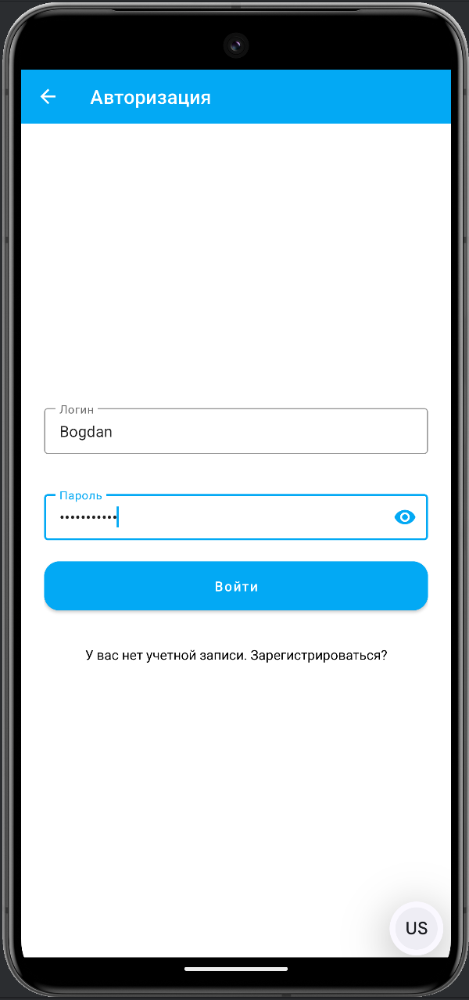
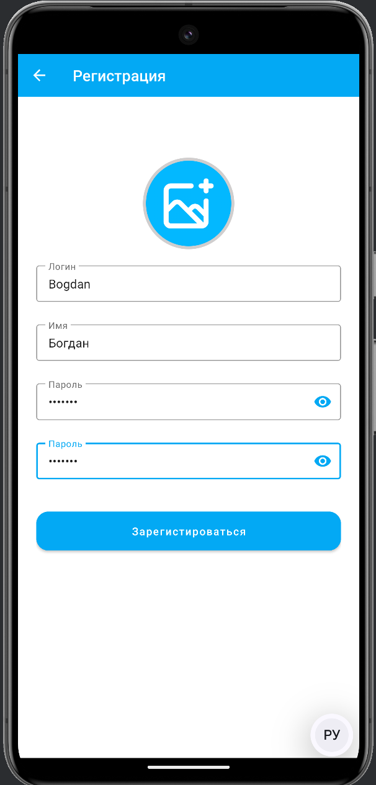
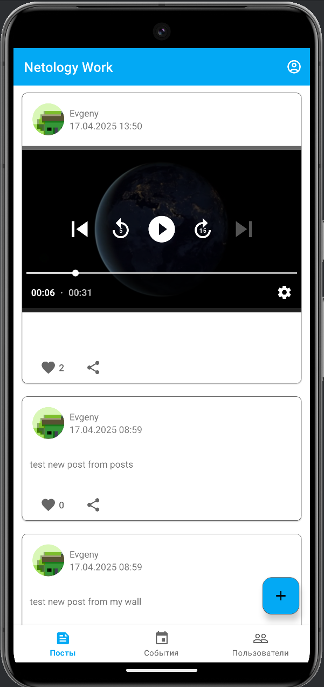
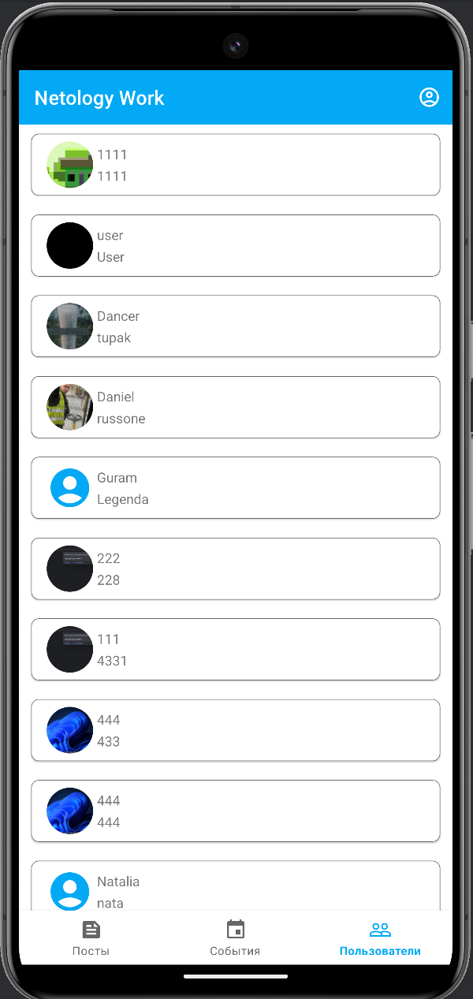
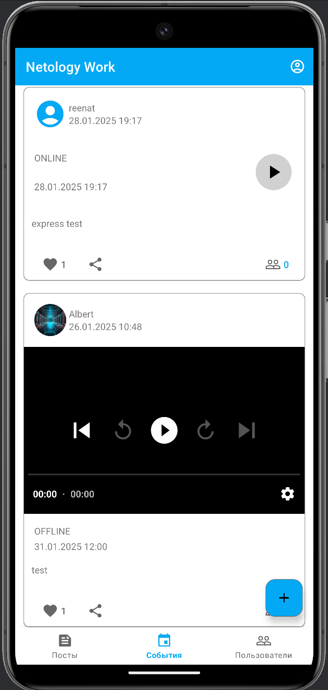
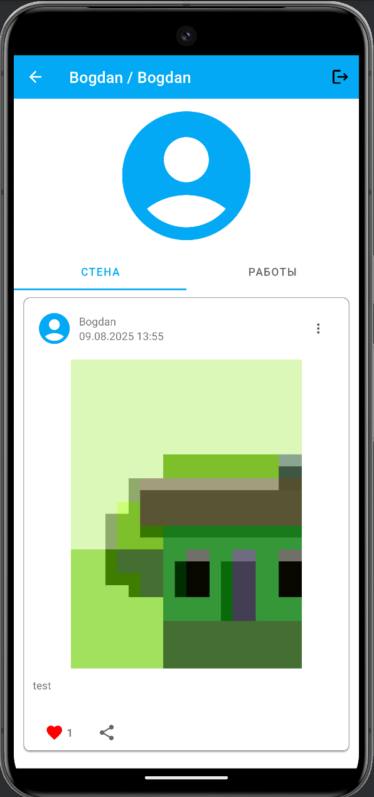

# Дипломный проект "Netology Work"

### Профессия Android Developer

---

### Краткое описание:

В рамках дипломного проекта разработано приложение, в котором пользователи могут 
создавать посты и события с медиаресурсами, указывать места работы и социальные связи (упоминание в постах, конференциях)

### Инструменты:

- архитектура MVVM
- библиотеки:
    - Material Design
    - Coroutines
    - Room
    - Retrofit
    - LiveData, Flow
    - Paging
    - Hilt
    - YandexMapsMobile
    - ImagePicker, Glide
    - 
- ### Описание ключевых функций и возможностей:

- **Страницы регистрации и авторизациии**

Здесь пользователи могут создать новую учетную запись, указав имя, будующий логин и пароль для входа,
или ввести свои логин и пароль для входа в аккаунт.

- **Страница ленты постов**

- Страница на которой пользователи смогут видеть посты других пользователей, отмечать их поставив лайк, делиться постамии в других приложениях.

- **Страница списка пользователей (участников)**

Страница, на которой пользователи могут просматривать и искать других членов сообщества.

- **Страница событий**

Страница, на которой пользователи могут просматривать предстоящие события.

- **Страница профиля пользователя**

Страница, на которой пользователи могут просматривать информацию о своем профиле.

